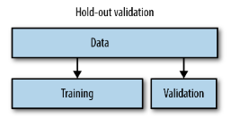

# Hold-out vs Cross-validation


머신러닝을 사용한 문제 해결은 일반적으로 다음의 과정을 거칩니다.

1. 문제에 관련된 train 데이터 수집
2. train 데이터 분석 및 조정
3. 머신러닝 모델을 사용해 train 데이터 학습
4. <u>**검증**</u> *(이 글의 주제)*
5. 실제 문제에 관한 데이터(test 데이터)로 결과 예측


최종 모델이 나와 테스트 해보기 전까지 test 데이터는 열어보거나 여러번 테스트를 해선 안되기 때문에, 그리고 일반적으로 test 데이터에는 정답(label)이 없기 때문에 **'현재 모델이 어느 정도의 성능을 갖는가'** 를 평가하려면 train 데이터를 통해 검증하는 수밖에 없습니다.

그런데 모델이 학습을 할때 검증할 데이터에 대해 미리 학습을 해두면 당연히 검증용 데이터셋에 대해서는 높은 성능을 보일 것입니다.

때문에 객관적인 모델 평가를 위해 train 데이터 학습 단계 전, train 데이터를

- A: 학습용 데이터
- B: 검증용 데이터

이렇게 나누고 A 데이터셋에 대해 학습 후, B 데이터셋의 정답(label)을 예측하고 점수를 매겨보는 과정을 거칩니다.


이 글에선 <u>**모델 검증 (Validation)**</u> 에서 사용되는 **Hold-out** 과 **Cross-validation** 에 대해 작성하였습니다.


## Hold-out



기본적이고 이해하기 쉬운 방법입니다. 

train 데이터를 **학습용**, **검증용** 두 서브 데이터셋으로 나눕니다. 일반적으로 학습용과 검증용으로 나누는 비율은 8:2 입니다.

```python
train_dataset, val_dataset = train[:len(train)*0.8], train[len(train)*0.8:]
```

이렇게 간단한 코드로 표현될 수 있으나 train 데이터의 순서에 특정한 패턴이 있을 경우 모델이 그 패턴을 학습할 수 있으므로 train 데이터를 한번 섞어주는 과정을 거칩니다.

```python
shuffled_index = np.arange(len(train))
np.random.shuffle(shuffled_index) # index 셔플
train = train[shuffled_index]
train_dataset, val_dataset = train[:len(train)*0.8], train[len(train)*0.8:]
```

만약 train 데이터의 순서가 의미있을 경우(ex. 시계열 데이터) 위의 섞는 과정을 거쳐선 안됩니다.


**scikit learn** 패키지에 Hold-out split 이 구현되어 있습니다.

```python
from sklearn.model_selection import train_test_split

train_X, val_X, train_y, val_y = train_test_split(train, label, train_size=0.8, random_state=42) 
# index 셔플시 random_state 값을 seed 값으로 사용하며, 데이터셋이 여러개이면 동일한 index 순서로 셔플합니다. (단, 길이가 같아야합니다.)
```


## Cross-validation

**k-fold cross validation** 라고도 합니다.

train 데이터를 k 개 그룹으로 나누고 그룹 중 하나를 **검증용(validation)** 데이터로, 나머지 k-1 개 그룹을 **학습용(train)** 데이터로 사용합니다.

그리고 다음 하나를 검증용 데이터로, 이전 단계에서 검증용으로 쓰였던 그룹을 포함해 k-1 개 그룹을 학습용 데이터로 사용합니다.

이 과정을 k 번 반복하며 각 split 마다 모델의 validation score 가 나오게 됩니다.

k 개의 validation score 의 평균을 최종 validation score 로 삼습니다.

과정은 아래의 그림과 같습니다.


하나의 모델이 k 번 학습-검증의 과정을 거치기 때문에 **hold-out** 검증 방법보다 robust 한 validation score 를 얻을 수 있다는 장점이 있습니다.


## Hold-out vs. Cross-validation

여러번의 검증 과정을 거치는 **Cross-validation** 방식이 좀 더 신뢰도 높은 점수를 내놓는데 비해 **Hold-out** 방식은 사용할 이유가 없어보이지만 각각 장/단점이 있고 쓰임이 다릅니다.


- Cross-validation
  - 신뢰도 높은 validation score 를 얻을 수 있습니다.
  - 하지만 k 번 반복해야 하기에 많은 컴퓨팅 파워를 필요로 합니다.
- Hold-out
  - 한번만 검증하기 때문에 split 하는 구간에 따라 validation score 가 크게 바뀔 수 있습니다.
  - 하지만 적은 연산을 필요로 한단 점에서, 간단한 초기 모델 검증이나 데이터셋이 아주 클 경우 Hold-out 방식을 사용합니다.


## Reference

[https://medium.com/@eijaz/holdout-vs-cross-validation-in-machine-learning-7637112d3f8f](https://medium.com/@eijaz/holdout-vs-cross-validation-in-machine-learning-7637112d3f8f)