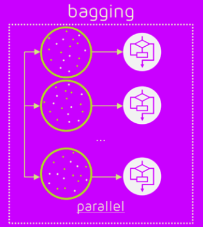
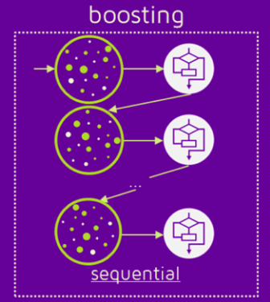
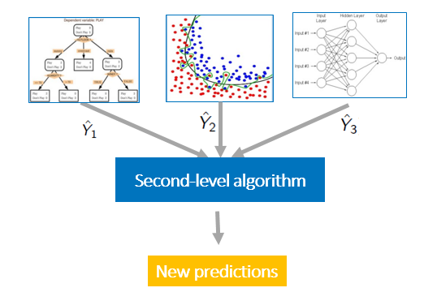

# Introduction to Ensemble Learning

머신러닝에서 높은 예측 정확도를 얻으려면 하나의 알고리즘으로 구성된 모델 하나면 충분할까요?

만약 95% 정확도의 모델이 예측한 정답이 시스템에 있어 중대한 부분을 차지한다면, 우리는 이 시스템을 전적으로 신뢰하기는 힘들겁니다. 100번중의 5번은 중대한 오류를 낼테니까요.

그럼 이번엔 95%의 정확도를 가진 서로 다른 모델 10개가 동일한 정답을 내놓았다고 합시다. 이제는 이 시스템을 전보다 더 신뢰할 수 있을겁니다.

이 글에선 여러 모델을 통해 문제를 해결하는 <u>**앙상블**</u> 기법에 대해 알아봅니다.

## Ensemble Learning 이란?

**앙상블(Ensemble)** 학습은 여러개의 학습 알고리즘의 예측을 합쳐서 더 나은 예측을 내놓는 기법입니다.

강한 머신러닝 모델 1개 대신에, 약한 머신러닝 모델 여러개를 결합해 구현합니다.

특히 [캐글](https://www.kaggle.com/)에서 높은 랭크에 도달하기 위해서 사용되며, 대부분의 캐글 컴피티션 우승 커널들에서 이 앙상블 학습 기법을 사용됐다고 합니다.

앙상블 학습 유형에는 크게,

- Voting & Averaging
- Bagging
- Boosting
- Stacking & Blending

이 있습니다.

## 1. Voting & Averaging

### Voting

**Voting** 방식은 여러개의 머신러닝 알고리즘이 내놓은 결과들 중에서 투표를 통해서 최종 예측값을 결정하는 방식입니다.

예를 들어, 타이타닉의 어떤 승객이 생존자일지, 사망자일지 예측할 때 10개의 **서로 다른** 머신러닝 알고리즘 중 6개는 생존, 4개는 사망으로 예측했다면 해당 승객의 최종 결과는 '생존' 으로 결정짓는 것이죠.

정해진 카테고리 내에서 투표로 결정하기 때문에, 주로 **분류** 문제에서 사용됩니다.

### Averaging

**Averaging** 방식은 여러개의 머신러닝 알고리즘이 내놓은 결과들을 평균내어 최종 예측값을 결정하는 방식입니다.

주로 **numerical** 한 예측값을 결정짓는데 사용되기 떄문에 **회귀** 문제에서 사용됩니다.

## 2. Bagging

**Bagging** 은 **B**ootstrap **Agg**regat**ing** 의 약자인데, 말그대로 *일련의 과정들을 집계*하게 됩니다.

**배깅** 방식은 이러한 방식을 갖습니다.

1. 동일한 알고리즘을 가진 여러개의 base model 을 만듭니다.
2. 각 모델을 전체 훈련 
3. 전체 train 데이터셋에서 랜덤하게 추출한 **서브 데이터셋**으로 훈련시킵니다.
4. 각각 서브 데이터셋으로 훈련된 모델들을 test 데이터셋에 대해 예측시킵니다.
5. 최종적으로 각 모델들이 예측한 값을 **Voting** 을 통해 결정합니다.

**Voting** 방식과 유사하지만, 각 모델을 전체 train 데이터셋이 아닌 서**브 데이터셋**으로 훈련시킨다는 점이 다릅니다.

또한 **서브 데이터셋**을 추출할 때,  단순히 모델 수 n개 만큼 전체 데이터셋을 split 하는 것이 아니라, 랜덤하게 **복원 표본 추출(sampling with replacement)** 을 통해 **서브 데이터셋**을 추출합니다.

그래서 **서브 데이터셋** 사이에는 중복된 데이터가 존재할 수 있고, 최종적으로 훈련에 사용되지 않은 데이터도 존재할 수 있습니다.

**랜덤 복원 표본 추출**로 서브 데이터셋을 생성해 학습하기 때문에 각 데이터셋 생성에는 서로가 영향을 주지 않고, 모델들도 개별적으로 학습하면 되므로 **병렬 연산**이 가능합니다.

**배깅** 방식의 대표적인 알고리즘으로 그 유명한 **랜덤 포레스트(Random Forest)** 가 있습니다. 여러개의 **결정 트리(Decision Tree)** 들이 각각 서브 데이터셋에 대해 훈련한 후 최종 결과를 결정하게 됩니다.

## 3. Boosting

**Boosting** 방식은 여러개의 머신러닝 알고리즘 모델들이 길게 줄을 서 있고 앞의 머신러닝의 결과를 넘겨받고, 뒤의 머신러닝에게 자신의 학습결과를 넘겨주는 방식이라고 보면 됩니다.

각 머신러닝 모델들이 **순차적**으로 학습을 하고 잘못 예측한 데이터에 대해 **가중치를 부여**하고, 뒤의 머신러닝 모델이 해당 **오류를 개선**해나가며 학습-예측 합니다.

최종적으로 가장 마지막 모델이 예측한 결과는 대부분의 오류에 대해 개선이 된 예측값이라고 볼 수 있겠죠.

**Boosting** 방식은 각 모델들이 서로에게 영향을 주는 구조이기 때문에 병렬 연산은 불가능합니다.

**Boosting** 방식의 대표적인 알고리즘은

- AdaBoost
- Gradient Boost
- XGBoost
- LightGBM
- CatBoost

등이 있고, 뒤의 글에서 따로 설명하겠습니다.

## 4. Stacking & Blending

### Stacking

**Stacking** 방식은 stacked generalization 이라고도 하는데, 전체 train 데이터셋을 <u>**머신러닝 알고리즘으로**</u> **sub predict** 데이터셋을 만듭니다.

그리고 이 새롭게 생성된 **sub predict** 데이터셋을 다시 머신러닝 알고리즘으로 학습하는 것입니다.

말하자면, 머신러닝 알고리즘이

- **sub predict** 데이터셋을 만들기 위한 머신러닝 알고리즘
- **sub predict** 데이터셋을 바탕으로 최종 예측값을 만들기 위한 머신러닝 알고리즘

이렇게 2가지에 쓰이게 됩니다.

### Blending

**Stacking** 과 유사한 방법(거의 혼용해서 사용)이지만, **Stacking** 은 cross-fold-validation 을 사용하고, **Blending**은 holdout-validation 을 사용한다는 점이 다르다고 합니다.